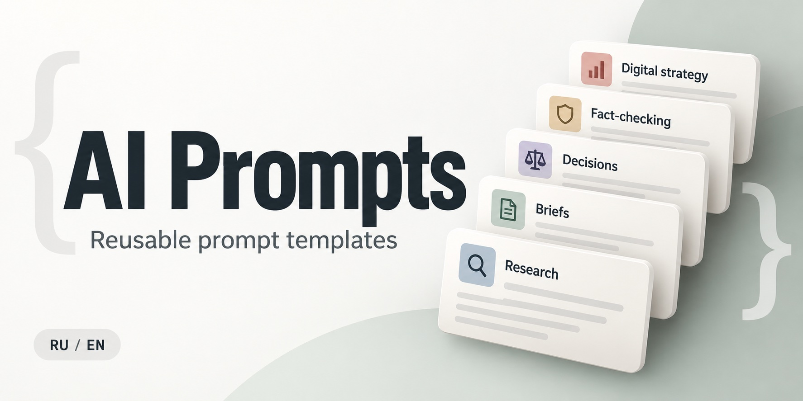

# AI Prompts / Шаблоны промптов для ИИ

## English

An open collection of reusable prompt templates for working with AI.

### Why this repository

In my experience, the quality of a starting prompt has a noticeable effect on the output of an AI agent. That is why I created an open repository of templates that help formulate such prompts.

These are not ready-made requests for every possible situation. They are prompt builders for a specific task: first, you define the context, objective, constraints, and expected result. Then, based on that information, you generate, review, and refine the final prompt before putting it to work.

### Available templates

| Template                                                                                                   | Description                                                                                                                                |
| ---------------------------------------------------------------------------------------------------------- | ------------------------------------------------------------------------------------------------------------------------------------------ |
| [Research Prompt](prompts/en/research-prompt.md)                                                           | Creates a self-contained prompt for planning and carrying out a research task.                                                             |
| [Brief and Requirements Prompt](prompts/en/brief-and-requirements-prompt.md)                               | Creates a self-contained prompt for preparing a task brief and requirements.                                                               |
| [Decision Analysis Prompt](prompts/en/decision-analysis-prompt.md)                                         | Creates a self-contained prompt for an evidence-based decision analysis.                                                                   |
| [Fact-Checking Prompt for a Text](prompts/en/fact-check-prompt.md)                                         | Creates a self-contained prompt for fact-checking a completed text or set of claims.                                                       |
| [Digital Lead Generation Strategy Prompt](prompts/en/digital-lead-generation-strategy-prompt.md)           | Creates a self-contained prompt for a micro or small business strategy covering lead acquisition, qualification, sales, and CRM selection. |

### How to use

1. Choose a template in the needed language.
2. Copy it and fill in the fields in square brackets.
3. Review the resulting prompt against your task's constraints before using it.

Templates describe a task; they do not grant permission to publish, send data, connect services, or take other external actions.

## Русский

Открытая коллекция переиспользуемых шаблонов промптов для работы с ИИ.

### Зачем этот репозиторий

На своём опыте я убедился: качество стартового промпта заметно влияет на результат работы ИИ-агента. Поэтому я открыл публичный репозиторий с шаблонами, которые помогают формулировать такие промпты.

Это не набор готовых запросов «на все случаи жизни», а конструкторы под конкретную задачу. Сначала вы фиксируете контекст, цель, ограничения и ожидаемый результат. Затем на этой основе создаёте, проверяете и при необходимости дорабатываете финальный промпт — и только после этого запускаете его в работу.

### Доступные шаблоны

| Шаблон                                                                                                           | Назначение                                                                                                          |
| ---------------------------------------------------------------------------------------------------------------- | ------------------------------------------------------------------------------------------------------------------- |
| [Промпт для исследования](prompts/ru/research-prompt.md)                                                         | Создаёт самодостаточный промпт для планирования и проведения исследования.                                          |
| [Промпт для брифа и требований](prompts/ru/brief-and-requirements-prompt.md)                                     | Создаёт самодостаточный промпт для подготовки брифа и требований к задаче.                                          |
| [Промпт для анализа решения](prompts/ru/decision-analysis-prompt.md)                                             | Создаёт самодостаточный промпт для обоснованного анализа решения.                                                   |
| [Промпт для фактчекинга текста](prompts/ru/fact-check-prompt.md)                                                 | Создаёт самодостаточный промпт для фактчекинга готового текста или набора утверждений.                              |
| [Промпт для Digital-стратегии привлечения лидов и заявок](prompts/ru/digital-lead-generation-strategy-prompt.md) | Создаёт самодостаточный промпт для стратегии микро- или малого бизнеса: рынок, каналы, заявки, продажи и выбор CRM. |

### Как пользоваться

1. Выберите шаблон на нужном языке.
2. Скопируйте его и заполните поля в квадратных скобках.
3. Перед использованием сверьте получившийся промпт с ограничениями своей задачи.

Шаблоны описывают задачу, но не дают разрешения на публикацию, отправку данных, подключение сервисов или другие внешние действия.

## License / Лицензия

This repository is licensed under [Creative Commons Attribution 4.0 International](https://creativecommons.org/licenses/by/4.0/). You may share and adapt its contents, including commercially, provided that you give appropriate attribution.

Содержимое репозитория распространяется по лицензии Creative Commons Attribution 4.0 International. Его можно копировать, распространять и изменять, в том числе коммерчески, при указании авторства.
